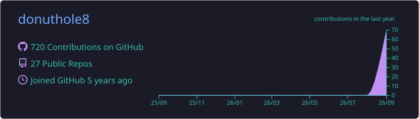
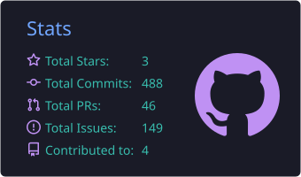
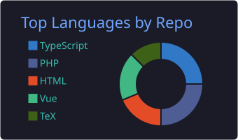
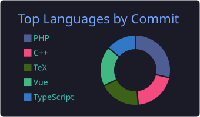

<!-- Header -->

  

  

  
  
  

## 🍩 About Me

- 💻 Web開発をメインに、フロントエンドからバックエンドまで幅広く触っています
- 🔬 大学院では画像処理を研究（機械学習・深層学習 / データ解析）
- 🏢 ブレインパッド、ナビタイムジャパン、データグリッド、QuickWork などで開発経験
- 🌱 最近は Next.js と AI を使ったプロダクトづくりに夢中

## 🛠 Tech Stack

   
  

## 🚀 Recent Projects

| Project | Description | Tech |
| :-- | :-- | :-- |
| ⚡ [**denki-isu**](https://github.com/donuthole8/denki-isu) | 2人で遊べるオンライン電気イスゲーム | HTML / JS |
| ☕ [**Coffeed**](https://github.com/donuthole8/myrss) | 珈琲を飲むあいだに情報収集を済ませる RSS / Atom リーダー（[Demo](https://myrss-self.vercel.app)） | TypeScript |
| 🫖 [**teatimes**](https://github.com/donuthole8/muro-blog) | 誰でも自分の times（分報）を持てるサービス | TypeScript |
| 🗺 [**trareco**](https://github.com/donuthole8/trareco) | Vue + Firebase製Webアプリ（[Demo](https://trareco-ccb11.web.app)） | Vue |

## 📊 GitHub Stats

  

  
  
  

  

<!-- Footer -->

  

